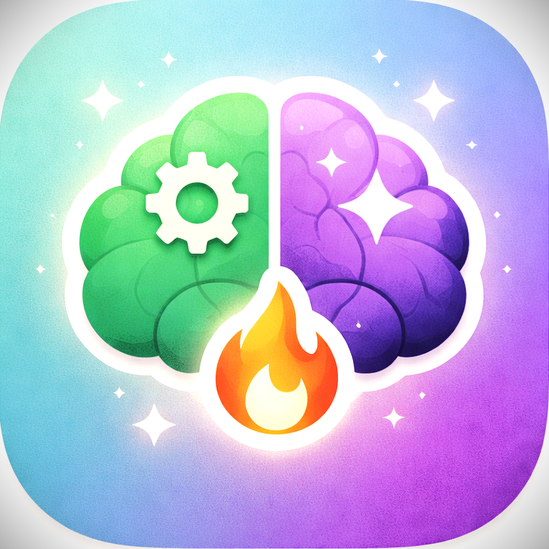
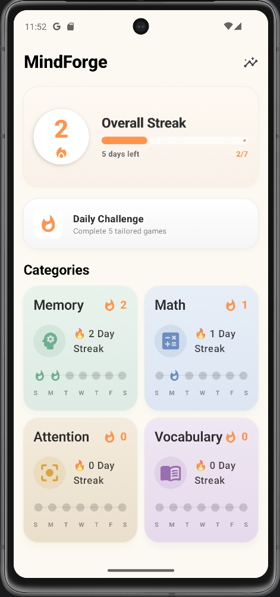
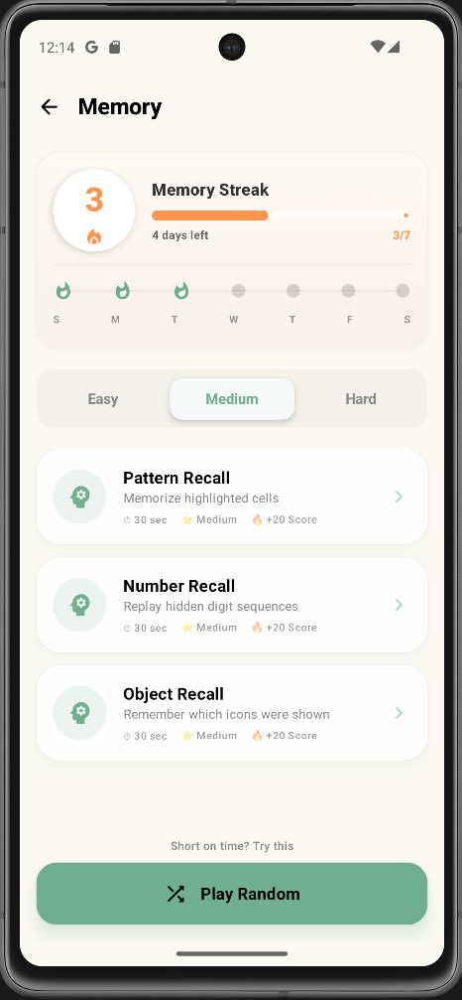
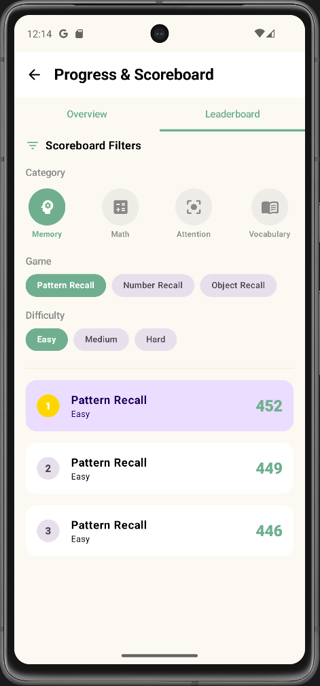

# 🧠 MindForge: Train Your Brain. Anytime. Anywhere.

MindForge is a comprehensive, offline-first brain training application designed to sharpen your memory, focus, and logic. With a variety of engaging mini-games and a progressive tracking system, it's your personal mental gym that fits in your pocket.

---

## 📸 App Showcase

  

### Explore the Interface

  
  
  

---

## ✨ Core Features

*   **🔒 100% Offline:** No internet? No problem. All games and progress tracking work completely locally.
*   **📅 Daily Challenge:** A unique set of 5 tasks generated every day to keep your mind active.
*   **📊 Local Leaderboards:** Compete against your own best sessions with detailed history and rankings.
*   **🔥 Streak System:** Stay motivated with daily streaks and category-specific progress.
*   **🧩 Diverse Game Library:** Includes memory recall, quick math, pattern recognition, reaction tests, and vocabulary builders.

---

## 🧠 Brain Training Categories

MindForge focuses on four essential cognitive pillars:

1.  **💡 Memory:** Pattern recall, number sequences, and object recognition.
2.  **🧮 Math:** Mental arithmetic, number series, and logic puzzles.
3.  **👁️ Focus:** Reaction tests, target tapping, and Stroop interference tasks.
4.  **📚 Language:** Synonyms, spelling, and vocabulary expansion.

---

## 🛠️ Tech Stack

*   **Language:** 100% Kotlin
*   **UI:** Jetpack Compose for a modern, declarative interface
*   **Navigation:** Compose Navigation
*   **Local Storage:** Room Database for persistent storage of stats and history
*   **Dependency Injection:** Hilt (Dagger)
*   **Architecture:** Clean Architecture with MVVM pattern
